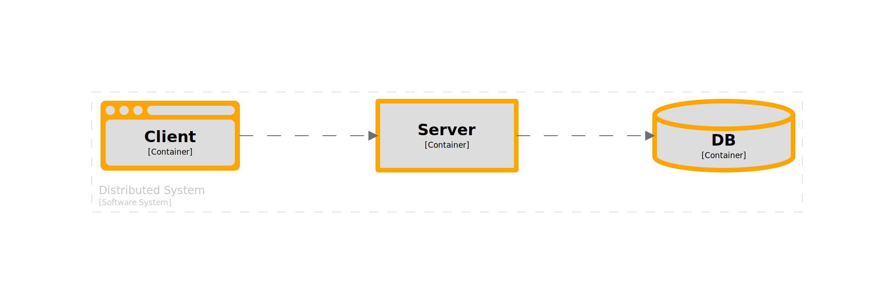
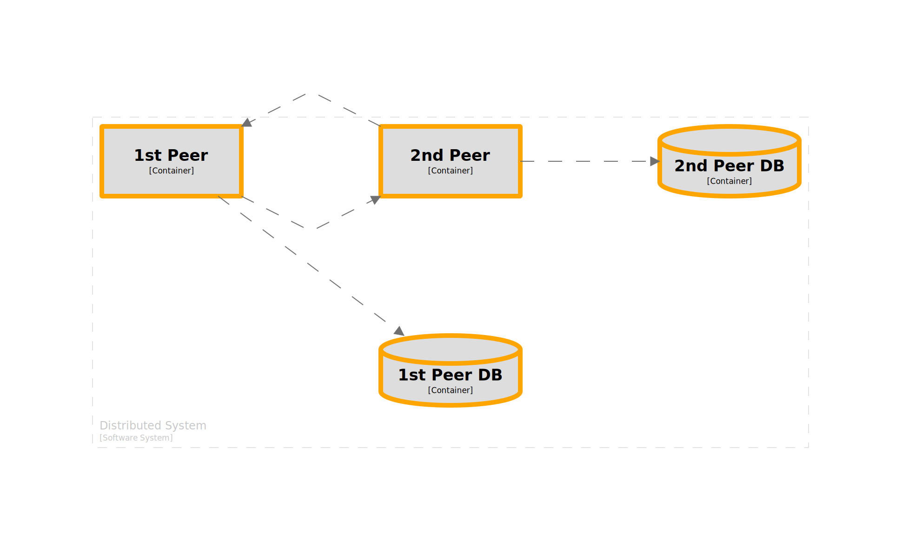
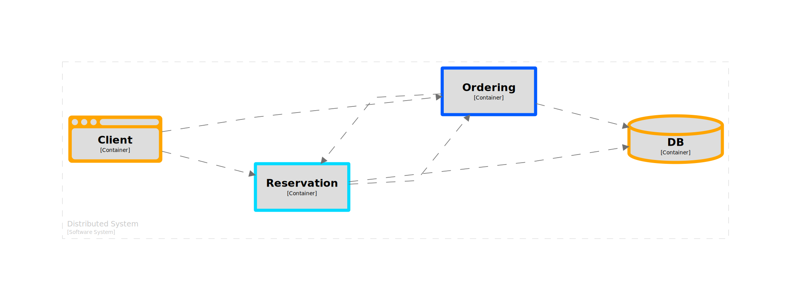

# DistributedSystems

Q/realistic-A bout distributed systems

## What is meant by "Distributed Systems"? 

### Chat GPT answer

Distributed systems are a collection of independent computers that appear to the users of the system as a single coherent system. These systems are designed to share resources and data among multiple machines to achieve common goals, improve performance, reliability, scalability, and flexibility.

### Realistic answer

Given that theoritical answer, almost all of the systems that we work on are distibuted, specially considering the 1st two distributed system types below:
- _Client Server_ 
- _N-Tier_ 
- Peer-To-Peer **(P2P)** 
- Service-Oriented Architecture **(SOA)** 
- Microservices 
- Micro-Frontends

**_Conventionally_**, we refer to the 1st two types as monotlithic systems, while they are actually distributed!

So, we apply some of the distributed system related aspects to those claimed monolithic systems e.g. scalability where we sometimes scale out the endpoints, or scale up the DB process.

but when it comes to the implicitly known distributed ones, the handling gets magnified a lot due to the large number of scattared processes and how they are distributed, which requires well known  patterns to handle that.

## So, does it mean that all the software systms are distributed?

### Realistic answer

No,
- Non data-centric systems e.g. calculator, are almost real monolithics
- Single process data-centeric systems e.g. Access DB, are real monolithics since the interface, logic, and data store are running as a single process

## What to distribute?

### Chat GPT answer

In distributed systems, various components and functionalities are distributed across multiple machines or nodes to achieve scalability, reliability, and performance. Here's an overview of what can be distributed in such systems:
- Data
- Computation
- Services
- Storage
- Messaging
- Security
- Networking
- Configuration

### Enriched answer

In addition to the above mentioned distibution aspects, the below also can be distributed: 

- Code base
- Build
- Deployment
- Hosting

## What are the aspects that when I find in a software solution, I describe that solution as "Distributed System"?

### Chat GPT answer

Identifying distributed systems from the code involves looking for certain patterns, architectures, and technologies that are commonly used in distributed computing. Here are some indicators that can help you recognize distributed systems:

- Network Communication
- Async programming
- Data Distribution
- Message Passing and Event Streaming
- Consistency and Synchronization Mechanisms

### Realistic answer

Actually it's not an easy question to answer, since not all the systems designed the same way, using the same design aspects, and perfectly follow the selected design aspect guidlines, however, there are things that can be inspect to give insights about if we are working on a type of the distributed systems, check below:

- Multiple code bases (repos)
- Infra layer(s)/service(s)
- Integration Platform as a Service **IPaaS**
- Multiple build pipelines
- Multiple release piplines
- Containers
- Container orchestrators

## If I have been developing monolithic apps for years and I am really good at it, can I start developing distributed systems, or I have to learn new things first?

### Chat GPT answer

Working on distributed systems requires a solid understanding of various principles, technologies, and tools. Here is a comprehensive guide on what to learn:

- Fundamentals of Distributed Systems
  - **Concurrency and Parallelism**
  - Networking Basics
  - Distributed Algorithms
  - **CAP Theorem**
  - **Data Consistency Models**
  - **Fault Tolerance and Reliability**
  - **Scalability**
- Distributed Computing Frameworks and Tools
  - Relational Databases
  - NoSQL Databases
  - Distributed File Systems
- Data Processing
  - Batch Processing
  - **Stream Processing**
- Service Architecture
  - Service mesh
  - Service Discovery
  - **API Management**
- Message Queues and Event Streaming
  - **Message Brokers**
  - **Event Streaming**
- **Cloud Platforms**
- **Centeralized logging**
- **Centeralized monitoring**
- Practical Experience
- Communities and Conferences

### Enriched answer

Beside the above mentioned/highlighted aspects, the below are aspects that will likely to require addressing when working on a distributed systems: 

- Paradigm shift
- Dual/Multiple writes
  - At least once transmission/Transactional Outbox
- Transaction
  - Orchestration
  - Coreography  
- Events
  - Event Driven
  - Event sourcing
  - Event data store
  - Big data
  - Replay
  - Memory image
  - Decoupling consumption from handling
    - Inbox pattern
  - Duplicate transmission
    - Defensive consumption
  - Naming
  - Regex-baed subsciption
  - DLQ/handling
- Containerization
- container orchestration
  - Singleton pattern 
- DevOps
  - Infra structure as Code **(IaC)**
  - CI/CD
- Reporting
  - Data Lake
  - Data warehouse
  - Data lakehouse
- Observability
  - Alerting
- Zero downtime breaking changes/backword comptibility
- Trunk based development
- Feature flags
- Versioning
  - API
  - Class/Object/Entity/Schema
  - Data
- Correlation
  - ID
  - Transaction

## Would you please give an example of real-world distributed systems, and explain the architecture and technologies behind them?

### Chat GPT answer

Examples of Distributed Systems:

- Google search
- Amazon.com
- Netflix
- Apache Kafka
- Blockchain

### Enriched answer

I highly recommend checking the [system-design-primer](https://github.com/donnemartin/system-design-primer) GIT hub repo, it has a lot about large scale system architecture and design.

and regarding the question we can refere to the [X/Twitter](https://github.com/donnemartin/system-design-primer/blob/master/solutions/system_design/twitter/README.md) sample from that repo.

### highlighting what will be different if the same application wasn't distributed system

#### Will check it agains that below quality attributes:

- Scalability
- Availability
  - Redundancy
  - Failover 
- Reliability
  - Fault Tolerance 
- Performance
- Security
- Manageability
  - Observability
  - Automation
- Interoperability
- Flexibility
  - Modularity
- Consistency
- Usability
